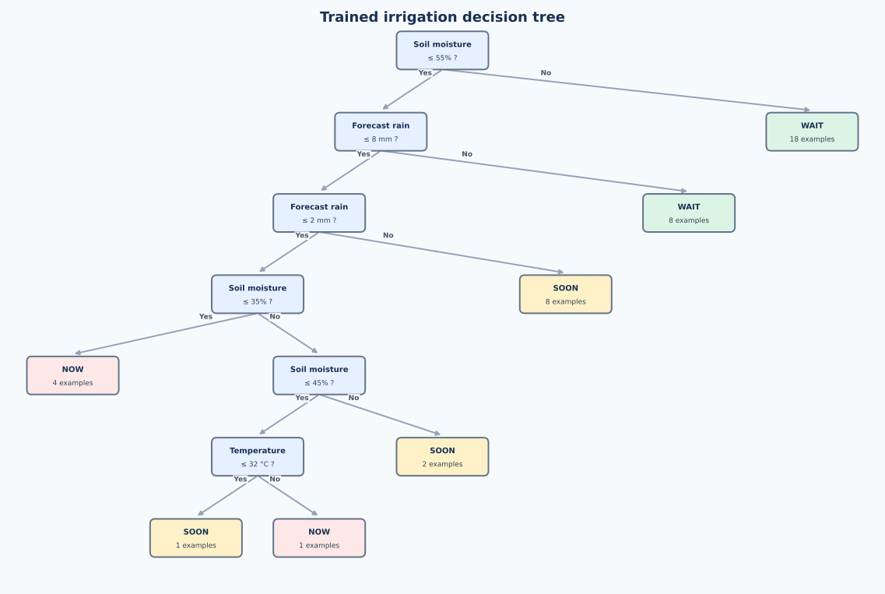

# AI Based Irrigation Recommendation

A small Object Oriented Software Engineering lab CA prototype for the **AI Irrigation Advisory System for Sugarcane Crop**. It demonstrates one functional requirement: use plot conditions to suggest an irrigation date and duration.

The app is designed for a short live demonstration. It uses simulated readings, an interpretable decision tree, and three ready-made scenarios. It does not connect to real sensors, weather services, or irrigation pumps.

## Run on Windows

Install Python 3.11 or newer. In a terminal opened inside this folder, run:

```powershell
py -m pip install -r requirements.txt
py app.py
```

If `py` is unavailable, replace it with `python`. The app uses Tkinter, which is included in a normal Windows Python installation. Keep `training_examples.csv` beside `app.py`.

For a quick terminal demo or automated check:

```powershell
py app.py --demo
py -m unittest -v
```

## Live demo

1. Open **Plot dashboard**. The three sample plots show Now, Soon, and Wait, plus local alerts for plots due today or tomorrow.
2. Return to **Recommendation**, click **Dry soil**, then **Generate recommendation**. The model suggests irrigation today and shows a local app alert.
3. Click **View decision tree**. Gold boxes and lines trace the current inputs to the Now leaf.
4. Click **Rain expected**, generate again, and view its different path to Wait. The dashboard updates when you generate a recommendation.
5. If time permits, enter soil moisture `120` to show input validation.

You can also change the numbers directly. The plot name identifies the demo plot; the model uses soil moisture, temperature, and forecast rain for the urgency class. The crop stage affects the illustrative duration.

## How it works

- `training_examples.csv` contains **42 illustrative, labelled scenarios**, not field measurements. The classroom labelling assumptions are: substantial forecast rain or high soil moisture means *Wait*; low moisture with little expected rain means *Now*; some intermediate cases mean *Soon*. High temperature can increase urgency in a moderately dry case.
- `IrrigationAdvisor` trains a `DecisionTreeClassifier` from those examples and predicts **Now**, **Soon**, or **Wait**. The displayed decision path shows the comparisons made by the trained tree.
- The program converts *Now* to today's date, *Soon* to tomorrow's date, and *Wait* to no scheduled irrigation plus a review in two days.
- `DURATIONS` maps urgency and growth stage to demonstration minutes. These times are explicit prototype assumptions, not outputs learned from farm observations.
- `PlotConditions` validates inputs, and `IrrigationApp` handles the Tkinter interface.
- The plot dashboard summarizes the three simulated plots. It shows **local app alerts** for recommendations dated today or tomorrow. No external notification is sent, and changes last only for the current session.

The sample examples were labelled for software demonstration. Agreement with those examples is **not** evidence of real-world prediction accuracy or safe irrigation guidance. A deployed system would need field data, agronomist-approved targets, independent validation, current forecasts, and local irrigation constraints.

## Visual decision tree

The diagram below shows the tree trained from the current sample CSV. Each blue box asks a yes/no question; colored end boxes show the predicted urgency. The app highlights the route for the plot currently entered.



## Files

| File | Purpose |
| --- | --- |
| `app.py` | Model, recommendation logic, GUI, and terminal demo |
| `training_examples.csv` | Illustrative labelled scenarios |
| `test_app.py` | Checks three scenarios and invalid inputs |
| `decision_tree.svg` | Full diagram of the trained tree |
| `CA_REPORT.md` | Aim, methodology, algorithm, and observed results |
| `PRESENTATION_GUIDE.md` | Short live-demo sequence, speaking notes, and viva answers |
| `requirements.txt` | Python dependency |
